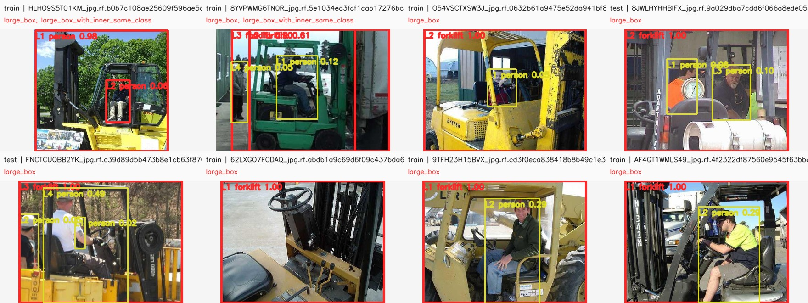
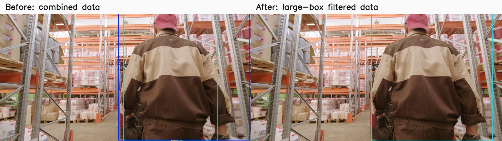
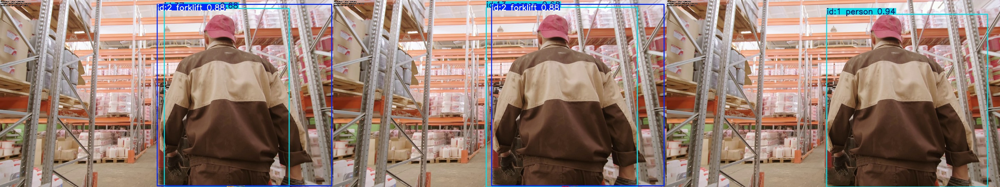

# 데이터 품질 검토

## 목적

외부 창고 영상에서 선반과 사람을 큰 `forklift` 박스로 탐지하고 사람을 중복 탐지하는 원인을 확인했다. 원본 데이터는 수정하지 않고, 자동 선별 결과와 사람이 검토한 판단을 재현 가능한 파일로 남겼다.

## 자동 선별 결과

`Forklift v1` 보강 데이터 421장을 다음 조건으로 검사했다.

- 박스 면적이 전체 이미지의 70% 이상
- 같은 클래스 박스의 IoU가 0.85 이상
- 서로 다른 클래스 박스의 IoU가 0.90 이상
- 큰 박스 내부에 같은 클래스의 작은 박스가 다시 존재

152장(36.1%)이 큰 박스를 포함했고, 그중 2장은 큰 박스 안에 같은 클래스의 작은 박스가 있었다. 상세 결과는 `reports/forklift-ground-label-review.json`과 `.csv`, 시각 자료는 로컬 `runs/label-review/forklift-ground`의 19개 contact sheet에 있다.

이미지 출처: [Forklift v1, Roboflow Universe](https://universe.roboflow.com/helmetaiworkspace/forklift-dsitv-yhncw/dataset/1), CC BY 4.0.

## 육안 검토 판단

큰 박스 대부분은 박스 좌표만 보면 지게차를 포함한다. 그러나 상품 사진, 장난감, 기계 일부의 근접 사진, telehandler 등 목표 창고 영상과 다른 이미지가 많고 지게차가 화면 대부분을 차지한다. 이 분포는 선반 기둥과 사람을 포함한 넓은 영역을 지게차로 예측하는 현상과 연결될 가능성이 높다.

명백한 라벨 문제 두 건은 `reports/forklift-ground-label-fixes.csv`에 기록했다.

- `HLHO9S5T01KM...`: 실제 운전자 박스 외에 화면 전체가 `person`으로 중복 지정됨.
- `8YVPWMG6TN0R...`: 비교적 타이트한 지게차 박스 외에 사람과 트럭까지 포함하는 큰 `forklift` 박스가 중복됨.

큰 박스를 일괄 오라벨로 단정하지 않는다. 이번 비교 실험에서는 목표 영상과의 구도 차이를 줄이기 위한 표본 필터로 사용한다.

## 파생 데이터셋

`prepare_curated_dataset.py`로 큰 박스가 포함된 이미지 152장을 제외한 로컬 파생본을 만들었다.

| split | 유지 | 제외 |
| --- | ---: | ---: |
| train | 181 | 114 |
| validation | 59 | 25 |
| test | 29 | 13 |
| 합계 | 269 | 152 |

파생 데이터의 이미지-라벨 대응, 정규화 좌표, split 중복 검사는 모두 통과했다. 이 필터가 실제 영상에 도움이 되는지는 동일한 모델·seed·입력 크기로 다시 학습한 뒤 기존 외부 영상에서 비교한다. 파생 test는 필터 조건에 의해 쉬워질 수 있으므로 기존 전체 ground test와 외부 영상 결과도 함께 기록한다.

## 동일 조건 재학습 결과

YOLO26s, 640 입력, batch 8, seed 42로 80 epoch를 다시 학습했다. validation mAP50-95는 전체 0.702, forklift 0.639, person 0.764였다. 기존 통합 모델의 전체 validation 0.719보다 낮다.

외부 영상 첫 300프레임의 tracking 로그 비교:

| 항목 | 기존 통합 모델 | 큰 박스 필터 모델 |
| --- | ---: | ---: |
| forklift 추적 행 | 340 | 49 |
| forklift 고유 ID / 단기 ID | 15 / 10 | 4 / 2 |
| forklift 프레임당 최대 박스 | 3 | 1 |
| forklift 90백분위 박스 면적 | 52.1% | 38.0% |
| person 고유 ID / 단기 ID | 16 / 13 | 9 / 4 |
| person 중복 프레임 비율 | 32.5% | 17.7% |

왼쪽 기존 모델의 화면 절반 `forklift` 오탐은 오른쪽에서 제거됐다. 동시에 가려진 실제 지게차를 중간 구간에서 놓치는 프레임이 많아졌다. 큰 박스를 일괄 제외하는 방식은 precision 성격의 문제를 줄였지만 recall을 과하게 희생했다. 최종 데이터 정책으로 확정하지 않고, 타깃 영상 라벨과 hard negative를 추가할 때의 비교 기준으로 보존한다. 원본 영상: [Pexels 4294434](https://www.pexels.com/video/man-walking-towards-the-forklift-inside-the-warehouse-4294434/).

원시 수치는 `reports/curated-model-evaluation.json`과 `reports/external-run-diagnostics.json`에 기록했다.

## NMS와 ByteTrack 분리 실험

데이터 변경 효과와 추적기 효과를 혼동하지 않기 위해 기존 통합 모델은 그대로 두고 설정만 바꿨다. detector confidence는 `0.10`으로 유지해 ByteTrack의 저신뢰 2차 연결을 보존하고, NMS IoU를 `0.70`에서 `0.50`, `track_high_thresh`와 `new_track_thresh`를 `0.25`에서 `0.40`으로 바꿨다. 설정은 `configs/inference.stable.yaml`과 `configs/bytetrack.stable.yaml`에 있다.

| 항목 | 기존 설정 | 안정형 설정 |
| --- | ---: | ---: |
| forklift 고유 ID / 단기 ID | 15 / 10 | 10 / 6 |
| forklift 겹침 프레임 | 6 | 0 |
| person 고유 ID / 단기 ID | 16 / 13 | 6 / 3 |
| person 겹침 프레임 | 81 | 0 |
| forklift 90백분위 박스 면적 | 52.1% | 51.8% |

ID 분할과 겹침은 줄었지만 큰 forklift 박스는 거의 같은 크기로 남았다. 추적기 설정은 이벤트 중복을 완화할 수 있지만 잘못 학습된 박스 경계를 고치지는 못한다. 또한 외부 영상에 정답 라벨이 없으므로 줄어든 추적 행이 오탐 제거인지 실제 객체 누락인지는 수치만으로 확정하지 않는다.

아래는 같은 150번째 프레임이다. 왼쪽부터 기존 통합 설정, 안정형 NMS·ByteTrack 설정, 큰 박스 이미지를 제외해 재학습한 모델이다. 가운데에서도 큰 `forklift` 오탐이 유지되고, 오른쪽은 이를 없애는 대신 가려진 실제 지게차도 놓친다.

## 해석 범위

이 검토는 큰 박스와 명백한 중복을 빠르게 찾는다. 객체 종류가 잘못됐는지, 같은 영상에서 추출된 유사 프레임인지, 가려진 객체의 경계를 일관되게 표시했는지는 사람이 추가로 확인해야 한다. 최종 현장 성능 검증에는 목표 카메라에서 별도로 라벨링한 validation 영상이 필요하다.
