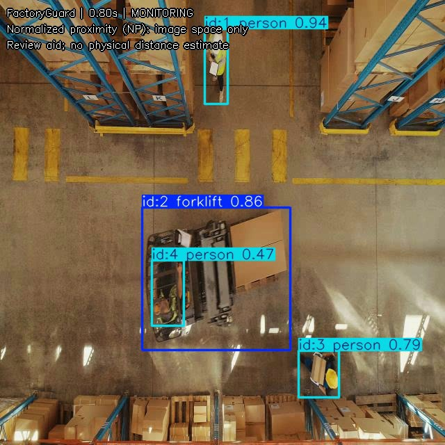

# 탑다운 전용 MVP 범위

FactoryGuard의 첫 완성 범위는 고정형 탑다운 또는 버드아이 창고 카메라로 제한한다. 학습과 운영 영상의 시점을 맞추면 지상 시점 데이터를 섞을 때 발생한 큰 `forklift` 박스와 도메인 시프트를 피할 수 있다.

## 사용할 구성

- 모델: Warehouse Safety 탑다운 데이터만 학습한 `runs/train/warehouse_yolo26s/weights/best.pt`
- 추적: `configs/bytetrack.stable.yaml`
- 거리 표현: person·forklift 박스 중심점 사이의 프레임 대각선 정규화 거리
- 출력: annotated MP4, `tracks.csv`, `events.csv`, `events.jsonl`, candidate clip
- 표현: normalized proximity, close approach, potential near-miss candidate

```bash
python infer.py --source "data/videos/topdown_site.mp4" --output "runs/topdown_site01" --config configs/topdown.yaml --device 0
```

`configs/topdown.yaml`은 `anchor_mode: center`를 사용한다. 이 값은 화면 좌표상의 상대적 근접도이며 실제 거리(m)나 사고 확률이 아니다. 현장 카메라가 바뀌면 임계값을 다시 검토해야 한다.



## 현재 검증된 것

- Warehouse Safety test 39장: 전체 mAP50-95 0.782, forklift 0.685, person 0.879.
- 탑다운 전용 설정으로 정지 프레임 반복 영상 75프레임을 처리해 annotated MP4, track CSV, 빈 event log와 summary 출력을 검증함.
- 75프레임 모두에서 forklift 1개와 person 3개가 각각 같은 ID를 유지했으며, 기본 중심점 임계값에서는 candidate가 생성되지 않음.
- 별도의 완화 임계값 통합 증명에서는 candidate log와 clip 추출까지 연결됨.
- 자동 테스트로 중심점 거리의 해상도 정규화와 출력 파일 생성이 검증됨.

test의 forklift 정답은 7개뿐이며 정지 프레임 반복 영상의 ID 유지는 추적 성능 평가가 아니다. 이 수치를 실제 현장 성능으로 일반화하지 않는다.

## 완성 판정에 필요한 마지막 입력

움직이는 탑다운 MP4에서 다음을 확인한다.

1. 사람과 지게차가 각각 연속 프레임에서 유지되는지 확인한다.
2. ID switch, 중복 박스, 명백한 누락 구간을 기록한다.
3. close approach 구간을 사람이 표시하고 이벤트 CSV와 비교한다.
4. 해당 카메라에 맞춰 enter/exit threshold와 최소 지속 시간을 고정한다.

현재 로컬의 `data/videos/test_frame65_loop.mp4`는 정지 이미지를 반복한 통합 증명용이다. 실제 탑다운 이동 영상으로 교체해야 추적과 이벤트 품질을 판단할 수 있다.
